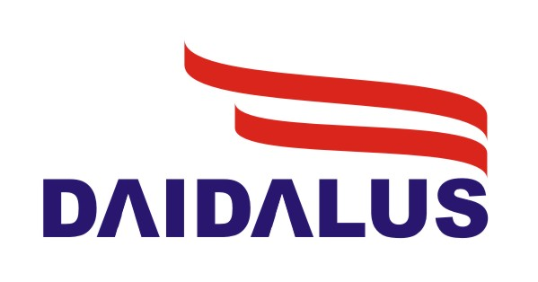

Detect and AvoID Alerting Logic for Unmanned Systems
========

Detect and Avoid Alerting Logic for Unmanned Systems (DAIDALUS) is a
software library that implements a configurable detect and avoid (DAA)
concept intended to support the integration of Unmanned Aircraft
Systems into civil airspace.  DAIDALUS serves as a reference
implementation of the functional requirements specified in DO-365, the
Minimum Operational Performance Standards (MOPS) for Unmanned Aircraft
Systems (UAS) developed by RTCA Special Committee 228 (SC-228).

This repository includes a prototype
implementations written in Java and C++.  The repository also includes
the formal specification of DAIDALUS core algorithms witten the Prototype
Verification System ([PVS](http://pvs.csl.sri.com)).

The core functionalities implemented by DAIDALUS include

*  detection logic,
*  alerting logic based on hazard and non-hazard volumes, and
*  instantaneous and kinematic maneuver guidance in the form of
suggestive guidance (i.e., bands) and directive guidance (i.e.,
preferred direction and velocity vector).

### Documentation

A draft of user guide is available at https://nasa.github.io/daidalus. 

### Software Library
The library can be compiled using the Unix utility `make` with the
provided `Makefile` in both the [Java](Java/Makefile) and
[C++](C++/Makefile) directories. From the directory Java,
the `make` command produces a jar file in the directory `Java/lib`.
From the directory C++, the `make` command will generate a static library
in `C++/lib`.

The sample application `DaidalusExample`, which is available in
[Java](Java/src/DaidalusExample.java) and
[C++](C++/src/DaidalusExample.cpp), illustrates the main
functionalities provided by DAIDALUS including reading/writing
configuration files, detection logic, alerting logic, maneuver
guidance logic, and computation of loss of well-clear contours.  This
application can be compiled using the provided `Makefile`.
To run the example application in a Unix environment, type from the
directory Java (or C++):

```
$ ./DaidalusExample
```

Other sample applications that illustrate DAIDALUS functionalities on
encounter files are provided in [Java](Java/README.md) and
[C++](C++/README.md).

### More information about DAIDALUS
For technical information about the definitions and algorithms in this
repository, visit https://shemesh.larc.nasa.gov/fm/DAIDALUS.

### Current Release

v2.0.2b, May-31-2021

### License

The code in this repository is released under NASA's Open Source
Agreement.  See the directory [`LICENSES`](LICENSES); see also the copyright notice at the end of this file. 

### Contact

[Aaron M. Dutle](http://shemesh.larc.nasa.gov/people/amd) (aaron.m.dutle@nasa.gov), NASA Langley Research Center.

### Logo

The DAIDALUS logo was designed by 
[Mahyar Malekpour](http://shemesh.larc.nasa.gov/people/mrm/publications.htm#ETC), NASA Langley Research Center.

### Copyright Notice

Copyright 2021 United States Government as represented by the Administrator of the National Aeronautics and Space Administration. All Rights Reserved.

No Warranty: THE SUBJECT SOFTWARE IS PROVIDED "AS IS" WITHOUT ANY WARRANTY OF ANY KIND, EITHER EXPRESSED, IMPLIED, OR STATUTORY, INCLUDING, BUT NOT LIMITED TO, ANY WARRANTY THAT THE SUBJECT SOFTWARE WILL CONFORM TO SPECIFICATIONS, ANY IMPLIED WARRANTIES OF MERCHANTABILITY, FITNESS FOR A PARTICULAR PURPOSE, OR FREEDOM FROM INFRINGEMENT, ANY WARRANTY THAT THE SUBJECT SOFTWARE WILL BE ERROR FREE, OR ANY WARRANTY THAT DOCUMENTATION, IF PROVIDED, WILL CONFORM TO THE SUBJECT SOFTWARE. THIS AGREEMENT DOES NOT, IN ANY MANNER, CONSTITUTE AN ENDORSEMENT BY GOVERNMENT AGENCY OR ANY PRIOR RECIPIENT OF ANY RESULTS, RESULTING DESIGNS, HARDWARE, SOFTWARE PRODUCTS OR ANY OTHER APPLICATIONS RESULTING FROM USE OF THE SUBJECT SOFTWARE.  FURTHER, GOVERNMENT AGENCY DISCLAIMS ALL WARRANTIES AND LIABILITIES REGARDING THIRD-PARTY SOFTWARE, IF PRESENT IN THE ORIGINAL SOFTWARE, AND DISTRIBUTES IT "AS IS."

Waiver and Indemnity: RECIPIENT AGREES TO WAIVE ANY AND ALL CLAIMS AGAINST THE UNITED STATES GOVERNMENT, ITS CONTRACTORS AND SUBCONTRACTORS, AS WELL AS ANY PRIOR RECIPIENT.  IF RECIPIENT'S USE OF THE SUBJECT SOFTWARE RESULTS IN ANY LIABILITIES, DEMANDS, DAMAGES, EXPENSES OR LOSSES ARISING FROM SUCH USE, INCLUDING ANY DAMAGES FROM PRODUCTS BASED ON, OR RESULTING FROM, RECIPIENT'S USE OF THE SUBJECT SOFTWARE, RECIPIENT SHALL INDEMNIFY AND HOLD HARMLESS THE UNITED STATES GOVERNMENT, ITS CONTRACTORS AND SUBCONTRACTORS, AS WELL AS ANY PRIOR RECIPIENT, TO THE EXTENT PERMITTED BY LAW.  RECIPIENT'S SOLE REMEDY FOR ANY SUCH MATTER SHALL BE THE IMMEDIATE, UNILATERAL TERMINATION OF THIS AGREEMENT.
