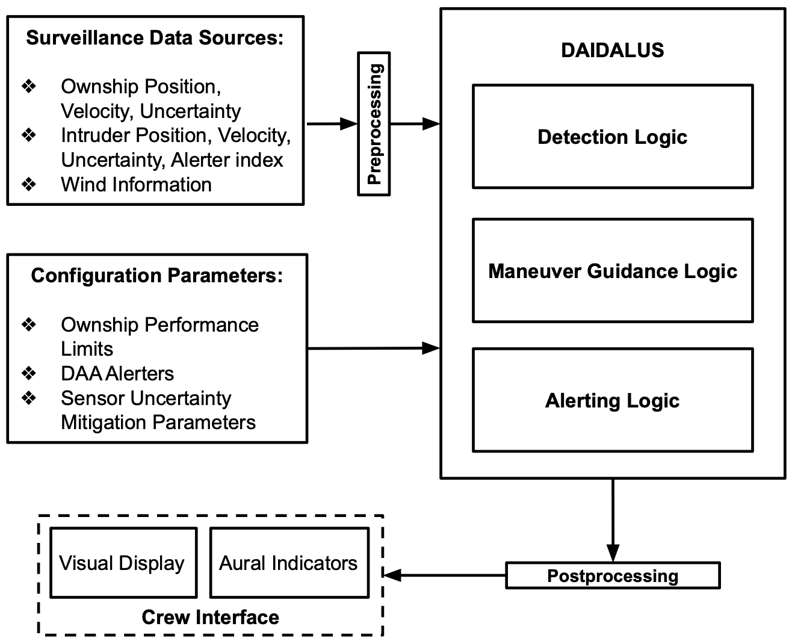
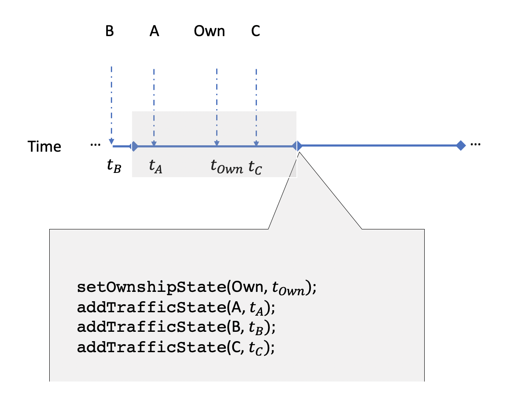

Note
====
This documentation concerns version 2 of DAIDALUS. Documentation on
version 1 is available from https://nasa.github.io/WellClear.

Reference Manual - DAIDALUS-v2.0.x
===

<!--ts-->
   * [Note](#note)
   * [Reference Manual - DAIDALUS-v2.0.x](#reference-manual---daidalus-v20x)
   * [Introduction](#introduction)
   * [Software Library](#software-library)
      * [DAIDALUS v2 vs. DAIDALUS v1](#daidalus-v2-vs-daidalus-v1)
      * [Getting the Code](#getting-the-code)
      * [Compiling the Code](#compiling-the-code)
      * [Example Applications](#example-applications)
   * [Preliminaries](#preliminaries)
      * [Packages and Name Space](#packages-and-name-space)
      * [Units](#units)
      * [Earth Projection and Aircraft States](#earth-projection-and-aircraft-states)
      * [Winds](#winds)
      * [Invalid Values](#invalid-values)
   * [DAIDALUS Inputs](#daidalus-inputs)
      * [Creating a Daidalus Object](#creating-a-daidalus-object)
      * [Configuring Daidalus Object](#configuring-daidalus-object)
      * [Providing Wind Information](#providing-wind-information)
      * [Adding Aircraft States](#adding-aircraft-states)
         * [Adding Ownship State](#adding-ownship-state)
         * [Adding Traffic State](#adding-traffic-state)
         * [Adding Sensor Uncertainty](#adding-sensor-uncertainty)
      * [Dealing with Asynchronous Inputs](#dealing-with-asynchronous-inputs)
   * [DAIDALUS Outputs](#daidalus-outputs)
      * [Alerting Logic](#alerting-logic)
      * [Maneuver Guidance Logic](#maneuver-guidance-logic)
   * [The Class KinematicMultiBands](#the-class-kinematicmultibands)
      * [Track (or Heading) Bands](#track-or-heading-bands)
      * [Ground Speed (or Air Speed) Bands](#ground-speed-or-air-speed-bands)
      * [Vertical Speed Bands](#vertical-speed-bands)
      * [Altitude Bands](#altitude-bands)
      * [Aircraft Contributing to Bands](#aircraft-contributing-to-bands)
      * [Resolutions](#resolutions)
      * [Time to Recovery](#time-to-recovery)
      * [Last Time to Maneuver](#last-time-to-maneuver)
   * [Alerters](#alerters)
   * [Sensor Uncertainty Mitigation](#sensor-uncertainty-mitigation)
   * [Hysteresis Logic](#hysteresis-logic)
   * [DTA Logic](#dta-logic)
   * [Configurable Parameters](#configurable-parameters)
      * [Basic Parameters](#basic-parameters)
      * [Pre-Defined Configurations](#pre-defined-configurations)
   * [Advanced Features](#advanced-features)
      * [Batch Simulation and Analysis Tools](#batch-simulation-and-analysis-tools)
   * [Contact](#contact)

<!-- Added by: cmunoz, at: Tue Oct  6 10:58:31 EDT 2020 -->

<!--te-->

# Introduction

DAIDALUS (Detect and AvoID Alerting Logic for Unmanned Systems) is a
reference implementation of the detect and avoid (DAA) functional
requirements  described in RTCA's Minimum Operational Performance
Standards (MOPS)  DO-365 and RTCA DO-365A developed by RTCA
Special Committee 228 (SC-228).

At the core of the  RTCA SC-228 DAA concept,
there is a mathematical definition of the well-clear concept. Two
aircraft are considered to be *well clear* of each other if
appropriate distance and time variables determined by the relative
aircraft states remain outside a set of predefined threshold
values. These distance and time variables are closely related to
variables used in the Resolution Advisory (RA) logic of the Traffic
Alert and Collision Avoidance System Version II (TCAS II).

DAIDALUS core logic is based on ownship-centric,
state-less algorithms that
* Determine the current pairwise well-clear status between ownship and
  traffic aircraft (**Detection Logic**)
* Compute maneuver guidance for the ownship to maintain or regain well- clear status
(**Maneuver Guidance Logic**)
* Determine pairwise alert level between ownship and
traffic aircraft (**Alerting Logic**)

The following diagram illustrates the high-level architecture of the
DAIDALUS library.

<p/>
<div align="center">

</div>
<p/>

DAIDALUS' maneuver guidance logic assumes non-maneuvering traffic
aircraft and supports, by configuration, either instantaneous or
kinematic maneuvers by the ownship. Manuever guidance is provided as
suggestive guidance (i.e., bands) and directive guidance (i.e.,
preferred direction and velocity vector).  Suggestive guidance is
computed in the form of range of track, ground speed, vertical speed,
and altitude values called *bands*. These bands represent ranges of
ownship maneuvers tha maintain well-clear status with respect to
traffic aircraft. In the case of a loss of well-clear, or when a
well-clear violation is unavoidable, well-clear recovery bands
represent ranges of ownship maneuvers to regain well-clear status.
Recovery bands are designed so that they improve the distance at
closest point of approach in a timely manner.  DAIDALUS' alerting
logic assumes non-maneuvering ownship and traffic aircraft. It
computes a numerical alert level based on a set set of increasingly
larger alert thresholds.

#  Software Library
DAIDALUS is provided as a software library implemented in both Java
and C++. Except for programming language idiosyncrasies, both Java and
C++ application programming interfaces are identical. DAIDALUS code is
available under
[NASA's Open Source Agreement](https://github.com/nasa/daidalus/tree/master/LICENSES/).
DAIDALUS algorithms are highly configurable and configuration can be
done either programmatically or by loading a configuration file. The core algorithms have
been
[formally specified and verified](https://github.com/nasa/WellClear/tree/master/PVS)
in the Prototype Verification System ([PVS](http://pvs.csl.sri.com)).

## DAIDALUS v2 vs. DAIDALUS v1
DAIDALUS v2 and v1 share the same logic and, by design, configuration
files are backward compatible. DAIDALUS v2 application programming
interface differs from DAIDALUS v1 and provides new and enhanced
functionality.  In particular, DAIDALUS v2 implements
* [Multiple and dynamic alerting logic](#alerters)
* [Sensor Uncertainty Mitigation](#sensor-uncertainty-mitigation) (SUM)
* [Hysteresis logic](#hysteresis-logic)
* [DAA Terminal Area (DTA) logic](#dta-logic)
* Enhanced alerting time logic

The application
[DAA-Displays](https://shemesh.larc.nasa.gov/fm/DAA-Displays) provides
a graphical interface that enables the side-by-side comparison of
(possibly) different versions of DAIDALUS on (possibly) different
configurations on a given encounter. 

## Getting the Code
The source code of DAIDALUS is available at
[GitHub/daidalus](https://github.com/nasa/daidalus). The following
git command gets the development version of DAIDALUS (the dollar sign
`$` represents the prompt of a Unix terminal):

```
$ git clone https://github.com/nasa/daidalus.git
```

In addition to the development version, three other releases are
available: v1.0.1 (October 11, 2017), v1.0.2 (April 21, 2019), and
v2.0.1 (August 12, 2020). These releases are available as branches in
the Git repository, e.g.,

```
$ git checkout v2.0.1
```

This documentation concerns version 2 of DAIDALUS. Documentation on
version 1 is available from https://nasa.github.io/WellClear.

## Compiling the Code
The code is self-contained and does not require any particular
library.

The Java code has been compiled in Mac OSX and Linux using

```
Java version "1.8.0_191"
Java(TM) SE Runtime Environment (build 1.8.0_191-b12)
Java HotSpot(TM) 64-Bit Server VM (build 25.191-b12, mixed mode)
```

The C++ code has been compiled in Mac OSX using

```
Apple clang version 11.0.0 (clang-1100.0.33.17)
Target: x86_64-apple-darwin18.7.0
Thread model: posix
```
and in Linux using:

```
g++ 7.4.0
```

The library and example applications can be compiled using the Unix utility `make` with the
provided `Makefile` in both the
[Java](https://github.com/nasa/daidalus/blob/master/Java/Makefile) and
[C++](https://github.com/nasa/daidalus/blob/master/C%2B%2B/Makefile)
directories. In Java, the `make` command will produce the jar file
`lib/DAIDALUSv2.X.x.jar`, where `X.x` are the major and minor release
numbers, e.g.,

```
$ make
** Building library lib/DAIDALUSv2.X.x.jar
javac src/gov/nasa/larcfm/IO/*.java src/gov/nasa/larcfm/Util/*.java src/gov/nasa/larcfm/ACCoRD/*.java
...
** Building example applications
javac -cp lib/DAIDALUSv2.X.x.jar src/*.java
```
In C++, the `make` command will generate the static library
`lib/lib/DAIDALUSv2.X.x.a`.

## Example Applications
In addition to Jar and library files, the `make` command compiles
several example applications.
The applications `DaidalusExample`, whose
source code is available in
[Java](https://github.com/nasa/daidalus/blob/master/Java/src/DaidalusExample.java) and
[C++](https://github.com/nasa/daidalus/blob/master/C%2B%2B/examples/DaidalusExample.cpp), illustrates the main
functionalities provided by DAIDALUS including reading/writing
configuration files, detection logic, alerting logic, maneuver
guidance logic, and computation of loss of well-clear contours for 
hard coded ownship and traffic states.
To run this program in a Unix environment, type

```
$ ./DaidalusExample
```
This very simple program can be executed with several
configurations. For a list of options, type

```
$ ./DaidalusExample --help
```

More sophisticated applications are also provided in the DAIDALUS
distribution (see  [Batch Simulation and Analysis Tools](#batch-simulation-and-analysis-tools)).

# Preliminaries

## Packages and Name Space
In Java, DAIDALUS consists of three packages in the hierarchy
`gov.nasa.larcfm`: `IO`, `Util`, and `ACCoRD`. In C++, the DAIDALUS
code is provided under the name space `larcfm`.
This document
will refer to classes in these packages and name space through unqualified
names.  The following table lists the main
DAIDALUS classes (including interfaces and enumerations) and, in the
case of Java, the package under which the class is defined. 

| Java Class | Java Package | C++ Header | C++ Code |
|--|--|--|--|
| [`Alerter.java`](https://github.com/nasa/daidalus/blob/master/Java/src/gov/nasa/larcfm/ACCoRD/Alerter.java) | `ACCoRD` | [`.h`](https://github.com/nasa/daidalus/blob/master/C%2B%2B/include/Alerter.h) |  [`.cpp`](https://github.com/nasa/daidalus/blob/master/C%2B%2B/src/Alerter.cpp) | 
| [`AlertThresholds.java`](https://github.com/nasa/daidalus/blob/master/Java/src/gov/nasa/larcfm/ACCoRD/AlertThresholds.java) | `ACCoRD` |  [`.h`](https://github.com/nasa/daidalus/blob/master/C%2B%2B/include/AlertThresholds.h) |  [`.cpp`](https://github.com/nasa/daidalus/blob/master/C%2B%2B/src/AlertThresholds.cpp) | 
| [`BandsRange.java`](https://github.com/nasa/daidalus/blob/master/Java/src/gov/nasa/larcfm/ACCoRD/BandsRange.java) | `ACCoRD` | [`.h`](https://github.com/nasa/daidalus/blob/master/C%2B%2B/include/BandsRange.h) |  [`.cpp`](https://github.com/nasa/daidalus/blob/master/C%2B%2B/src/BandsRange.cpp) | 
| [`BandsRegion.java`](https://github.com/nasa/daidalus/blob/master/Java/src/gov/nasa/larcfm/ACCoRD/BandsRegion.java) | `ACCoRD` | [`.h`](https://github.com/nasa/daidalus/blob/master/C%2B%2B/include/BandsRegion.h) |  [`.cpp`](https://github.com/nasa/daidalus/blob/master/C%2B%2B/src/BandsRegion.cpp) |
| [`CD3DTable.java`](https://github.com/nasa/daidalus/blob/master/Java/src/gov/nasa/larcfm/ACCoRD/CD3DTable.java) | `ACCoRD` | [`.h`](https://github.com/nasa/daidalus/blob/master/C%2B%2B/include/CD3DTable.h) |  [`.cpp`](https://github.com/nasa/daidalus/blob/master/C%2B%2B/src/CD3DTable.cpp) | 
| [`CDCylinder.java`](https://github.com/nasa/daidalus/blob/master/Java/src/gov/nasa/larcfm/ACCoRD/CDCylinder.java) | `ACCoRD` | [`.h`](https://github.com/nasa/daidalus/blob/master/C%2B%2B/include/CDCylinder.h) |  [`.cpp`](https://github.com/nasa/daidalus/blob/master/C%2B%2B/src/CDCylinder.cpp) |
| [`ConflictData.java`](https://github.com/nasa/daidalus/blob/master/Java/src/gov/nasa/larcfm/ACCoRD/ConflictData.java)  | `ACCoRD` | [`.h`](https://github.com/nasa/daidalus/blob/master/C%2B%2B/include/ConflictData.h) |  [`.cpp`](https://github.com/nasa/daidalus/blob/master/C%2B%2B/src/ConflictData.cpp)|
| [`Daidalus.java`](https://github.com/nasa/daidalus/blob/master/Java/src/gov/nasa/larcfm/ACCoRD/Daidalus.java) | `ACCoRD` | [`.h`](https://github.com/nasa/daidalus/blob/master/C%2B%2B/include/Daidalus.h) |  [`.cpp`](https://github.com/nasa/daidalus/blob/master/C%2B%2B/src/Daidalus.cpp) |
| [`DaidalusFileWalker.java`](https://github.com/nasa/daidalus/blob/master/Java/src/gov/nasa/larcfm/ACCoRD/DaidalusFileWalker.java)  | `ACCoRD` | [`.h`](https://github.com/nasa/daidalus/blob/master/C%2B%2B/include/DaidalusFileWalker.h) |  [`.cpp`](https://github.com/nasa/daidalus/blob/master/C%2B%2B/src/DaidalusFileWalker.cpp) |
| [`DaidalusParameters.java`](https://github.com/nasa/daidalus/blob/master/Java/src/gov/nasa/larcfm/ACCoRD/DaidalusParameters.java) |  `ACCoRD` | [`.h`](https://github.com/nasa/daidalus/blob/master/C%2B%2B/include/DaidalusParameters.h) |  [`.cpp`](https://github.com/nasa/daidalus/blob/master/C%2B%2B/src/DaidalusParameters.cpp) |
| [`Detection3D.java`](https://github.com/nasa/daidalus/blob/master/Java/src/gov/nasa/larcfm/ACCoRD/Detection3D.java) | `ACCoRD` | [`.h`](https://github.com/nasa/daidalus/blob/master/C%2B%2B/include/Detection3D.h) |  [`.cpp`](https://github.com/nasa/daidalus/blob/master/C%2B%2B/src/Detection3D.cpp) |
| [`Horizontal.java`](https://github.com/nasa/daidalus/blob/master/Java/src/gov/nasa/larcfm/ACCoRD/Horizontal.java) | `ACCoRD` | [`.h`](https://github.com/nasa/daidalus/blob/master/C%2B%2B/include/Horizontal.h) |  [`.cpp`](https://github.com/nasa/daidalus/blob/master/C%2B%2B/src/Horizontal.cpp) |
| [`TCASTable.java`](https://github.com/nasa/daidalus/blob/master/Java/src/gov/nasa/larcfm/ACCoRD/TCASTable.java) | `ACCoRD` | [`.h`](https://github.com/nasa/daidalus/blob/master/C%2B%2B/include/TCASTable.h) |  [`.cpp`](https://github.com/nasa/daidalus/blob/master/C%2B%2B/src/TCASTable.cpp) |
| [`TCAS3D.java`](https://github.com/nasa/daidalus/blob/master/Java/src/gov/nasa/larcfm/ACCoRD/TCAS3D.java) | `ACCoRD` | [`.h`](https://github.com/nasa/daidalus/blob/master/C%2B%2B/include/TCAS3D.h) |  [`.cpp`](https://github.com/nasa/daidalus/blob/master/C%2B%2B/src/TCAS3D.cpp) |
| [`TrafficState.java`](https://github.com/nasa/daidalus/blob/master/Java/src/gov/nasa/larcfm/ACCoRD/TrafficState.java) | `ACCoRD` | [`.h`](https://github.com/nasa/daidalus/blob/master/C%2B%2B/include/TrafficState.h) |  [`.cpp`](https://github.com/nasa/daidalus/blob/master/C%2B%2B/src/TrafficState.cpp) |
| [`Vertical.java`](https://github.com/nasa/daidalus/blob/master/Java/src/gov/nasa/larcfm/ACCoRD/Vertical.java) | `ACCoRD` | [`.h`](https://github.com/nasa/daidalus/blob/master/C%2B%2B/include/Vertical.h) |  [`.cpp`](https://github.com/nasa/daidalus/blob/master/C%2B%2B/src/Vertical.cpp) |
| [`WCVTable.java`](https://github.com/nasa/daidalus/blob/master/Java/src/gov/nasa/larcfm/ACCoRD/WCVTable.java) | `ACCoRD` | [`.h`](https://github.com/nasa/daidalus/blob/master/C%2B%2B/include/WCVTable.h) |  [`.cpp`](https://github.com/nasa/daidalus/blob/master/C%2B%2B/src/WCVTable.cpp) |
| [`WCV_TAUMOD.java`](https://github.com/nasa/daidalus/blob/master/Java/src/gov/nasa/larcfm/ACCoRD/WCV_TAUMOD.java) | `ACCoRD` | [`.h`](https://github.com/nasa/daidalus/blob/master/C%2B%2B/include/WCV_TAUMOD.h) |  [`.cpp`](https://github.com/nasa/daidalus/blob/master/C%2B%2B/src/WCV_TAUMOD.cpp) |
| [`WCV_TAUMOD_SUM.java`](https://github.com/nasa/daidalus/blob/master/Java/src/gov/nasa/larcfm/ACCoRD/WCV_TAUMOD_SUM.java) |  `ACCoRD` | [`.h`](https://github.com/nasa/daidalus/blob/master/C%2B%2B/include/WCV_TAUMOD_SUM.h) |  [`.cpp`](https://github.com/nasa/daidalus/blob/master/C%2B%2B/src/WCV_TAUMOD_SUM.cpp) |
| [`WCV_TCPA.java`](https://github.com/nasa/daidalus/blob/master/Java/src/gov/nasa/larcfm/ACCoRD/WCV_TCPA.java) | `ACCoRD` | [`.h`](https://github.com/nasa/daidalus/blob/master/C%2B%2B/include/WCV_TCPA.h) |  [`.cpp`](https://github.com/nasa/daidalus/blob/master/C%2B%2B/src/WCV_TCPA.cpp) |
| [`WCV_TEP.java`](https://github.com/nasa/daidalus/blob/master/Java/src/gov/nasa/larcfm/ACCoRD/WCV_TEP.java) | `ACCoRD` | [`.h`](https://github.com/nasa/daidalus/blob/master/C%2B%2B/include/WCV_TEP.h) |  [`.cpp`](https://github.com/nasa/daidalus/blob/master/C%2B%2B/src/WCV_TEP.cpp) |
| [`Interval.java`](https://github.com/nasa/daidalus/blob/master/Java/src/gov/nasa/larcfm/Util/Interval.java) | `Util` | [`.h`](https://github.com/nasa/daidalus/blob/master/C%2B%2B/include/Interval.h) |  [`.cpp`](https://github.com/nasa/daidalus/blob/master/C%2B%2B/src/Interval.cpp) |
| [`Position.java`](https://github.com/nasa/daidalus/blob/master/Java/src/gov/nasa/larcfm/Util/Position.java) |  `Util` | [`.h`](https://github.com/nasa/daidalus/blob/master/C%2B%2B/include/Position.h) |  [`.cpp`](https://github.com/nasa/daidalus/blob/master/C%2B%2B/src/Position.cpp) |
| [`Units.java`](https://github.com/nasa/daidalus/blob/master/Java/src/gov/nasa/larcfm/Util/Units.java) |  `Util` | [`.h`](https://github.com/nasa/daidalus/blob/master/C%2B%2B/include/Units.h) |  [`.cpp`](https://github.com/nasa/daidalus/blob/master/C%2B%2B/src/Units.cpp) |
| [`Vect2.java`](https://github.com/nasa/daidalus/blob/master/Java/src/gov/nasa/larcfm/Util/Vect2.java) | `Util` | [`.h`](https://github.com/nasa/daidalus/blob/master/C%2B%2B/include/Vect2.h) |  [`.cpp`](https://github.com/nasa/daidalus/blob/master/C%2B%2B/src/Vect2.cpp) |
| [`Vect3.java`](https://github.com/nasa/daidalus/blob/master/Java/src/gov/nasa/larcfm/Util/Vect3.java) | `Util` | [`.h`](https://github.com/nasa/daidalus/blob/master/C%2B%2B/include/Vect3.h) |  [`.cpp`](https://github.com/nasa/daidalus/blob/master/C%2B%2B/src/Vect3.cpp) |
| [`Velocity.java`](https://github.com/nasa/daidalus/blob/master/Java/src/gov/nasa/larcfm/Util/Velocity.java) |  `Util` | [`.h`](https://github.com/nasa/daidalus/blob/master/C%2B%2B/include/Velocity.h) |  [`.cpp`](https://github.com/nasa/daidalus/blob/master/C%2B%2B/src/Velocity.cpp) |

## Units
DAIDALUS core algorithms use as internal units meters, seconds, and
radians. However,  interface methods that set or get a value have a string argument, where the units are
explicitly specified. The following table provides a list of symbols and the corresponding
string representation supported by DAIDALUS.

| Units  | String |
| --|-- |
| milliseconds | `"ms"` |
| seconds | `"s"` |
| minutes | `"min"` |
| hours | `"h"` | `"hr"` |
| meters | `"m"` |
| kilometers | `"km"` |
| nautical miles | `"nmi"`, `"NM"`  |
| feet | `"ft"` |
|  knots | `"knot"`, `"kn"`, `"kts"` |
|  meters per second | `"m/s"` |
|  kilometers per hour | `"kph"`, `"km/h"` |
| feet per minute | `"fpm"`, `"ft/min"` |
|  meters per second<sup>2</sup>|`"m/s^2"` |
| 9.80665 m/s<sup>2</sup> | `"G"` |
|  degrees | `"deg"` |
| radians | `"rad"` |
| degrees per second | `"deg/s"` |
| radians per second | `"rad/s"` |

The class `Units` provides the following static methods for converting
to/from internal units and  from one unit into another one.

 * `static double to(String unit, double value)`: Converts `value` to the units indicated by
  the parameter `unit` from internal units.
 * `static double from(String unit, double value)`: Converts `value` from the units indicated by
  the parameter `unit` to internal units.
* `static double convert(double fromUnit, double toUnit, double
value)`: Converts `value` from the units indicated by the parameter `fromUnit` to the units indicated by the parameter
`toUnit`.
  
## Earth Projection and Aircraft States
The main DAIDALUS interface methods support inputs
in geodesic coordinates (latitude, longitude, and altitude) and this
is the preferred way to provide inputs to DAIDALUS.
Internally, the core algorithms use a Euclidean local East, North, Up (ENU)
Cartesian coordinate system. DAIDALUS uses an
orthogonal projection of the ownship and traffic geodesic coordinates
onto a plane tangent to the projected ownship position on the surface
of the earth. The vertical component is not transformed.

Aircraft positions are represented by the class
`Position`. Positions are specified in geodesic
coordinates using
the following static method, where  northern latitudes and eastern longitudes are positive. 

* `static Position makeLatLonAlt(double lat, String lat_unit, double
  lon, String lon_unit, double alt, String alt_unit) `: Creates geodesic position at latitude `lat`, longitude `lon`, and altitude
  `alt` given in `lat_unit`, `lon_unit`, and `alt_unit` units, respectively.

Aircraft velocities are represented by the class
`Velocity`. Velocities are specified relative to the ground in
polar coordinates using the following static
method, where track is given in true north clockwise convention.

* `static Velocity makeTrkGsVs(double trk, String trk_unit, double gs, String gs_unit,
      double vs, String vs_unit)`: Creates velocity with track`trk`,
      ground speed `gs`, and vertical speed `vs` given in
	  `trk_unit`, `gs_unit`, and `vs_unit` units, respectively.

For testing and debugging purposes, position and velocities can
alternatively be given using a Euclidean local ENU Cartesian coordinate system. In
this case, DAIDALUS assumes that 
all traffic aircraft states are provided using the same coordinate
system as the one used by the ownship . The static methods to create `Position`
and `Velocity` objects using a Cartesian system are:

* `static Position makeXYZ(double x, double x_unit, double y, double 
  y_unit, double z, double z_unit)`: Creates  ENU position with 
  Euclidean coordinates (`x`,`y`,`z`) given in 
  `x_unit`, `y_unit`, and `z_unit` units, respectively. 

* `static Velocity makeVxyz(double vx,
	  double vy, String
      vxy_unit, double vz, String vz_unit)`: Creates ENU velocity
      with Euclidean coordinates (`vx`,`vy`,`vz`) given in `vxy_unit`,
      `vxy_unit`, and `vz_unit` units respectively.

## Winds
DAIDALUS implements a simple wind model that is globally applied using
a velocity vector. When a wind vector is provided, DAIDALUS uniformly
applies the wind vector to all current and future aircraft states
until another vector (possibly zero, i.e., "no-wind") is set.  This
vector can be provided using either a "TO" (wind blowing direction) or
a "FROM" (direction wind source from ownship's point of view) convention. An
important consequence of setting a wind vector is that all
computations and outputs become relative to the wind.

## Invalid Values
Methods in DAIDALUS fail silently and return invalid values when
called with invalid parameters. The following tables list methods that
check the validity of values in DAIDALUS classes.

| Class/Type | Validity Check (Java) | Invalidity Check (Java) | 
| -- | -- | -- |
| `double d;` | `Double.isFinite(d)`, `Double.isInfinite(d)`| `Double.isNaN(d)` |
|`AlertThresholds athr` | `athr.isValid()` |
| `Alerter a;` | `a.isValid()` |
| `BandsRegion r;` | `r.isValidBand()` |
| `Interval i;` | `i.isEmpty()` |
| `Velocity v;` | | `v.isInvalid()` |
| `Position p;` | |`p.isInvalid()` |
| `TrafficState s;` | `s.isValid()` |

In C++, the methods are the same except in the following cases.

| Class/Type | Validity Check (C++) | Invalidity Check (C++) | 
| -- | -- |--|
| `double d;` | `ISFINITE(d)`, `ISINF(d)` | `ISNAN(d)` |
| `BandsRegion r;` | `BandsRegion::isValidBand(r)` |

Furthermore, a negative integer value is returned as an invalid value
in methods that under normal conditions return a natural number, e.g.,
`int aircraftIndex(String name)` returns the index of an aircraft state given an aircraft identifier, e.g., `name`. The
index is `0` if `name` is the ownship identifier and a positive number if `name` is the identifier of a traffic state. A negative value `-1` is returned when there is no aircraft identified with the string `name`.

# DAIDALUS Inputs

The DAIDALUS software library is ownship
centric. Its main functional features are provided through the class
`Daidalus`, which maintains the global configuration, the wind configuration, and the current ownship and traffic aircraft states. In a multi-threaded application, there should only a
`Daidalus` object per ownship and it should not be simultaneously written by different threads.

Except for the configuration maintained in a `Daidalus` object,
DAIDALUS functions are memoryless, i.e., they compute information
using the current aircraft states and do not keep memory of
previous aircraft states. However, DAIDALUS uses an eager computational
approach, where some information is pre-computed and cached, and then
reused when needed. The cache memory is
conservatively cleared by methods that modify the configuration of the `Daidalus`
object.

DAIDALUS assumes that there is a notion of time-step that is provide
by the host application using the DAIDALUS library. At every time step
the ownship state is first set and then traffic aircraft states are
provided. DAIDALUS does not provide any functionality to filter, fuse,
or pre-process aircraft state information. If needed, any
pre-processing has to be implemented by the host application.  Within
the same time-step, alerting and guidance information is computed. A
typical DAIDALUS application has the following steps:

1. [Create a `Daidalus` object](#creating-a-daidalus-object), e.g., `daa`, to provide DAA functionality to the ownship.
1. [Configure `daa`](#configuring-daidalus-object). This object can
be reconfigured at any time. However, in a typical application, a `Daidalus` object is
configured at the beginning of the application and the configuration
remains invariant through the execution of the program.
1. At every time-step:
   1. Provide Inputs
	  1. If available,
         [set wind vector](#providing-wind-information). This wind
         vector is applied to current and future aircraft states (ownship and traffic) until another wind vector is set. 
	  1. [Set ground-based state information for ownship](#adding-ownship-state)
         into `daa`. If available,
         [set standard and co-standard deviations](#adding-sensor-uncertainty)
         for ownship position and velocity information. 
	  1. Set ground-based state information for all traffic aircraft
         into `daa`. If available, [set standard and co-standard
         deviations](#adding-sensor-uncertainty) for traffic position
         and velocity information.
   1. Compute Outputs
	  1. Get detection, alerting, and guidance information from `daa`.
	  1. Use output information as appropriate. DAIDALUS does not provide any functionality to
display or post-process its outputs. If needed, any
post-processing has to be implemented by the host application.

Because of the eager computational approach used by DAIDALUS, the
steps above are the *preferred* way to use DAIDALUS: at each
time step there is a first phase where all inputs for a given
time-step  are provided and then a
second phase where all outputs for the given time-step are computed
and processed. If outputs are computed before all inputs are provided,
cache memory may be clear resulting in a sound but more inefficient
computation. Furthermore, if hysteresis logic is enabled clearing the
cache memory will also result in clearing hysteresis information.

In a real DAA application, not every input is available at the same
time. Different sensors may have different frequencies and 
traffic information is available in an asynchronous way.  In that
case, synchrony could be introduced by the host application, for
example by running a process that executes at a given frequency (e.g., 1hz).

## Creating a `Daidalus` Object
In Java, a `Daidalus` object is created through the call
```java
Daidalus daa = new Daidalus();
```
The same can be accomplished in C++, using stack memory:

```C++
Daidalus daa;
```
In both cases, the variable `daa` is initialized to an empty DAA logic.

## Configuring `Daidalus` Object
A `Daidalus` object can be configured either programmatically or via a
configuration file. For instance,
```java
daa.set_DO_365A();
```
set `daa` to DO 365A default values, i.e.,
- Alerting logic for two alerters using, respectively, Phase I and Phase II, thresholds is enabled
- Maneuver guidance logic is set to kinematic maneuvers
- Turn rate is set to 3 deg/s
- Sensor Uncertainty Mitigation (SUM) is enabled
- Recovery bands are enabled and maneuver guidance is set such that bands do not saturate until NMAC
- Hysteresis logic is enabled
- DAA Terminal Area (DTA) is enabled

The same configuration can be achieved by loading the configuration file [`DO_365A_SUM.conf`](https://github.com/nasa/daidalus/blob/master/Configurations/DO_365A_SUM.conf) provided in the distribution, e.g.,
```java
daa.loadFromFile("DO_365A_SUM.conf");
```

The more general method call
```
daa.set_DO_365A(type,sum);
```
where both `type` and `sum` are boolean variables, set `daa` to DO 365A default values but
- turn rate is set to 3 deg/s when `type` is `true` and to 1.5 deg/s when `type` is `false`
- SUM is enabled when `sum` is `true` and disabled when `sum` is `false`.

For instance, the call
```java
daa. set_DO_365A(true,false);
```
is equivalent to loading the configuration file [`DO_365A_no_SUM.conf`](https://github.com/nasa/daidalus/blob/master/Configurations/DO_365A_no_SUM.conf) provided in the distribution, e.g.,
```java
daa.loadFromFile("DO_365A_no_SUM.conf");
```

DAIDALUS supports a large set of
[configurable parameters](#configurable-parameters)
that
govern the behavior of the detection, alerting, and
maneuver guidance logics. The simplest way to configure a
`Daidalus` object is through a configuration file. Examples of
configuration files are provided in the directory
[`Configurations`](https://github.com/nasa/daidalus/blob/master/Configurations/). These  configurations and programatic methods to achieve them are 
explained in the Section
[Pre-Defined Configurations](#pre-defined-configurations).

As seen in previous examples, the method call
```java
daa.loadFromFile(filename);
```
loads a configuration file, whose name is indicated by 
`filename`, into the `Daidalus` object `daa`.
Generally, a configuration file set values to all configurable parameters. However,
a configuration file may only provide values to the parameters that change with respect
to the current configuration in `daa`.  At any time, the current configurations can be written
into a file using the method call
```java
daa.saveToFile(filename);
```

The methods
`loadFromFile` and `saveToFile` of the class `Daidalus` return a boolean value. The value
`false` indicates that an input/output error has occurred, e.g., a file
cannot be read because it does not exist or a file cannot be written because
of insufficient permissions.

## Providing Wind Information
If available, a wind vector can be provided to a `Daidalus` object
`daa` using the method call
```
daa.setWindVelocityTo(wind_to);
```

or, alternatively,
```
daa.setWindVelocityFrom(wind_from);
```

where `wind_to` and `wind_from` are `Velocity` objects. The vector `wind_to` specifies the clockwise true north direction the wind blows. The vector `wind_from` specifies the  clockwise  true north direction of the wind source from the point of view of the ownship. The wind vector is applied to current and future aircraft states (ownship and traffic) until another wind vector is set.

The method call `daa.setNoWind()` disables wind computations for current and future aircraft states (ownship and traffic) until a wind vector is configured.

## Adding Aircraft States
A `Daidalus` object `daa` maintains the ownship state and a list of traffic aircraft states at a
given time of applicability, which is the time of the ownship state.
Aircraft identifiers are assumed to be unique within a `daa`
object. The order in which traffic aircraft are added is
relevant. Indeed, several `Daidalus` methods use the index of an
aircraft in the list of aircraft as a reference to the aircraft. The
index `0` is reserved for the ownship. It should be noted that
aircraft indices may change from time-step to time-step. 
The following methods are provided by the class 
`Daidalus`. 

* `int aircraftIndex(String id)`: Returns the index of the aircraft
identified by the string value of `id`.
The returned value is negative if the list of aircraft does not
include an aircraft identified by the string value of `id`.
* `int numberOfAircraft()`: Returns the number of aircraft in the list
of aircraft, including the ownship.
* `int lastTrafficIndex()`: Returns the index of the last
aircraft added to the list of aircraft.
* `double getCurrentTime()`: Returns the time of applicability in seconds.

### Adding Ownship State

The ownship state
can be added into a `Daidalus` object `daa`  using the method call
```java
daa.setOwnshipState(ido,so,vo,to);
```
where `ido` is the ownship identifier (string), `so` is a
`Position` object that indicates ownship position, `vo` is a
`Velocity` object that indicates ownship velocity, and `to` is an absolute time
stamp in seconds of the ownship state, i.e., the time of applicability. Setting the ownship state into
a `daa` object clear the list of traffic aircraft states. Thus, for a given time of
applicability, the ownship state has to be added before any other
aircraft state.

### Adding Traffic State

Traffic states can be added into `daa` using the method call
```java
aci_idx = daa.addTrafficState(idi,si,vi);
```
where `idi`, `si`, and `vi` are the traffic identifier, position, and
velocity, respectively.  Traffic states do not require a time stamp since it is
assumed to be the same the ownship's. If a time stamp is 
provided, e.g.,
```
daa.addTrafficState(idi,si,vi,ti);
```
the position of the traffic aircraft is linearly projected (forwards or
backwards in time) from `ti` to `to`, the time stamp of the ownship, so that
all traffic states are synchronized in time with the ownship.
The returned value `aci_idx` is the index of an aircraft `idi` after
it has been added
to the list
of aircraft.

### Adding Sensor Uncertainty
If a SUM configuration is enabled and sensor uncertainties for the
ownship/traffic aircraft are available, they can be set as follows.
```
daa.setHorizontalPositionUncertainty(ac_idx, s_EW, s_NS, s_EN, xy_units);
daa.setVerticalPositionUncertainty(ac_idx, sz, z_units);
daa.setHorizontalVelocityUncertainty(ac_idx, v_EW, v_NS, v_EN, vxy_units);
daa.setVerticalSpeedUncertainty(ac_idx, vz, vz_units);
```
where
* `ac_idx` is the index of the aircraft related to the
  uncertainties. The index `0` represents the ownship.
* `s_EW`, `s_NS`, `s_EN` are the East-West, North-South, East-North
standard deviations of the horizontal position in `xy_units` [units](#units).
* `sz` is the altitude uncertainty in `z_units` [units](#units).
* `v_EW`, `v_NS`, `v_EN` are the East-West, North-South, East-North
standard deviations of the horizontal velocity in `vxy_units` [units](#units).
* `vz` is the vertical speed uncertainty in `vz_units` [units](#units).

## Dealing with Asynchronous Inputs

<p/>
<div align="center">

</div>
<p/>

# DAIDALUS Outputs
The time to loss of well-clear, in seconds, between the ownship and the traffic aircraft at index `idx` for
the corrective alert level and lookahead time
configured in the `Daidalus` object `daa` can be 
computed as follows.
```java
double t2v = daa.timeToViolation(idx);
```
If `t2v` is zero, the aircraft are in violation at current time. The
method `timeToViolation` returns positive infinity when the
aircraft are not in conflict within the lookahead time. It returns
Not-A-Number when `idx` is not a valid aircraft index.

To compute time to loss of well-clear with respect to
any alert level, see Section [Advanced Features](#advanced-features).

## Alerting Logic
Given a `Daidalus` object `daa` of type `Daidalus`, 
the alert level between the ownship and the traffic aircraft at
index `idx` can be computed as follows
```java
int alert_level = daa.alerting(idx);
```
The value of `alert_level` is negative when `idx` is not a valid
aircraft index in `daa`. If `alert_level` is zero, no alert is issued
for the ownship and the traffic aircraft at index `idx` at
time of applicability. Otherwise, `alert_level` is a positive
numerical value that indicates the alert level, which by default are
configured as follows.

| `alert_level` | RTCA SC-228 Alert Level |
| -- | -- |
| `1` | Preventive |
| `2` | Corrective |
| `3` | Warning |

The `Daidalus` object `daa` can be configured to an arbitrary number
of alert levels and each alert level is highly configurable
(see Section [Advanced Features](#advanced-features)). The only
restriction is that alert levels are ordered by increased level of
severity.

## Maneuver Guidance Logic
In DAIDALUS, maneuver guidance is provided by the class `KinematicMultiBands`.
The following code creates an object `bands` of type `KinematicMultiBands` for the
aircraft in the `Daidalus` object `daa`.
```java  
KinematicMultiBands bands = daa.getMultiDaidalus();  
``` 
The previous code is written in Java. The corresponding code in C++ is
as follows.
```c++
KinematicMultiBands bands;
daa.multiDaidalus(bands); 
```
For efficiency reasons, bands are computed in a lazy way, i.e., the
methods `getKinematicMutliBands` (in Java) and `kinematicMultiBands` (in
C++) do not actually compute the bands. Section [The Class `KinematicMultiBands`](#the-class-kinematicmultibands),
bands are computed when the object `bands` is used. 

# The Class `KinematicMultiBands`
DAIDALUS provides maneuver guidance in the form of ranges of ownship
maneuvers called *bands*.
Four dimensions of bands are computed by DAIDALUS:

1. Horizontal maneuver ranges. These maneuvers indicate true track ranges,
except when wind information is provided. If that is the case, these
maneuvers indicate true heading ranges.
1. Horizontal speed ranges. These maneuvers indicate ground speed ranges,
except when wind information is provided. If that is the case, these
maneuvers indicate  air speed ranges.
1. Vertical speed ranges.
1. Altitude ranges.

In each dimension, bands are represented by an ordered list of
intervals that are disjoint except at the boundaries. These intervals
completely partition a range of values from a configurable minimum
value to a configurable maximum value. Each interval is associated
with a `BandsRegion`, which is defined as an enumerated type
consisting of the following values.

* `NONE`: Maneuvers indicated by intervals of this type are conflict free.
* `FAR`: This type of intervals is not configured by default in the
  maneuver guidance logic. However, it could be configured to indicate
  maneuvers that lead to a preventive alert.
* `MID`: The maneuvers indicated by intervals of this type lead to a corrective
alert.
* ` NEAR`: The maneuvers indicated by intervals of this type lead to a warning
alert.
* ` RECOVERY`: The maneuvers indicated by intervals of this type regain
well-clear status in a timely manner and without violating
configurable separation minima. By definition of the maneuver guidance logic, intervals of type
`RECOVERY` are computed only when there are no intervals of type
`NONE`.
*  `UNKNOWN`: This type of intervals signals an unexpected result, i.e., values that are outside the configured minimum/maximum values.

 Ownship performance limits and other parameters that govern the
 maneuver guidance logic can be configured  in either the
 `Daidalus` object from which the `bands` object
is constructed or in the `bands` object directly. The methods to set
and get these configuration parameters are described in 
 Section [Parameters](#parameters).

## Track (or Heading) Bands
The computation of track bands (heading bands, when wind information is
provided) requires either a turn rate or a bank angle. If both the turn rate
and the bank angle are zero, track/heading bands are computed assuming
instantaneous track/heading manevuers.  The following loop iterates the list of
intervals in the track/heading  bands and for each interval gets its upper and
lower bounds and its type.
```java
  for (int i = 0; i < bands.trackLength(); i++ ) {  
    Interval iv = bands.track(i,"deg"); //i-th band region
    double lower_trk = iv.low; //[deg]
    double upper_trk = iv.up;  //[deg]
    BandsRegion regionType = bands.trackRegion(i);
	...
  } 
```

## Ground Speed (or Air Speed) Bands
The computation of ground speed bands (air speed bands, when wind
information is provided) requires a horizontal acceleration. If this
acceleration is zero, ground speed/ air speed bands are computed
assuming instantaneous ground speed/air speed manevuers.  The following loop iterates the list of
intervals in the ground speed/air speed  bands and for each interval gets its upper and
lower bounds and its type.
```java
  for (int i = 0; i < bands.groundSpeedLength(); i++ ) {  
    Interval iv = bands.groundSpeed(i,"knot"); //i-th band region
    double lower_gs = iv.low; //[knot]
    double upper_gs = iv.up;  //[knot]
    BandsRegion regionType = bands.groundSpeedRegion(i);
    ... 
  } 
```

## Vertical Speed Bands
The computation of vertical speed bands requires a vertical acceleration. If this
acceleration is zero, vertical speed bands are computed
assuming instantaneous vertical speed manevuers.  The following loop iterates the list of
intervals in the vertical speed  bands and for each interval gets its upper and
lower bounds and its type.
```java
  for (int i = 0; i < bands.verticalSpeedLength(); i++ ) {  
    Interval iv = bands.verticalSpeed(i,"fpm"); //i-th band region
    double lower_vs = iv.low; //[fpm]
    double upper_vs = iv.up;  //[fpm]
    BandsRegion regionType = bands.verticalSpeedRegion(i);
    ... 
  } 
```

## Altitude Bands
The computation of altitude bands requires a vertical acceleration and
a vertical rate. If both the vertical acceleration and the vertical
rate are zero, altitude bands are computed
assuming instantaneous altitude manevuers.  The following loop iterates the list of
intervals in the altitude bands and for each interval gets its upper and
lower bounds and its type.

```java
  for (int i = 0; i < bands.altitudeLength(); i++ ) {  
    Interval iv = bands.altitude(i,"ft"); //i-th band region
    double lower_alt = iv.low; //[ft]
    double upper_alt = iv.up;  //[ft]
    BandsRegion regionType = bands.altitudeRegion(i);
    ... 
  } 
```

## Aircraft Contributing to Bands
Bands that are in the current path of the ownship are called 
conflict bands. Conflict bands simultaneously  appear for all type of
maneuvers, e.g., horizontal direction, horizontal speed, vertical
speed, and altitude. The list of aircraft contributing to conflict
bands for a particular alert level can be obtained as follows:
```java
List<TrafficState> acs = bands.conflictAircraft(alert_level);
```
The variable `alert_level` denotes a level between 1 and the most
severe alert level that has been configured.

Bands that are not in the current path of the ownship are called 
peripheral bands. Peripheral bands are different for different type
of maneuvers. The list of aircraft contributing to each type of 
bands for a particular alert level can be obtained as follows:
```java
List<TrafficState> acs_trk = bands.peripheralTrackAircraft(alert_level);
List<TrafficState> acs_gs = bands.peripheralGroundSpeedAircraft(alert_level);
List<TrafficState> acs_vs = bands.peripheralVerticalSpeedAircraft(alert_level);
List<TrafficState> acs_alt = bands.peripheralAltitudeAircraft(alert_level);
```

## Resolutions

## Time to Recovery

## Last Time to Maneuver

# Alerters

DAIDALUS also enables the configuration of alert level thresholds.
The following parameters can be configured per alert level (The
first level is 1) in a configuration file.

# Sensor Uncertainty Mitigation 

# Hysteresis Logic

# DTA Logic

# Configurable Parameters

DAIDALUS objects can be configured through the class variable
`parameters` of type `DaidalusParameters`. The configuration can
be done either programmatically using getter/setter methods or via a
configuration file using the method `loadFromFile`.  These methods are
defined in the class `DaidalusParameters`.

## Basic Parameters
The following is a list of parameters that can be configured
in DAIDALUS.

| Configuration Parameter | Getter/Setter | Description (Type) |
| -- | -- | -- |
| `lookahead_time` | `get/setLookaheadTime` | Time horizon of all DAIDALUS functions (Time) |
| `left_trk` | `get/setLeftTrack` | Relative maximum horizontal direction maneuver to the left of current ownship direction (Angle) |
| `right_trk` | `get/setRightTrack` | Relative maximum horizontal direction maneuver to the right of current ownship direction (Angle)|
| `min_gs` | `get/setMinVerticalSpeed` |Absolute minimum horizontal speed maneuver  (Speed)|
| `max_gs` | `get/setMaxGroundSpeed` |Absolute maximum horizontal speed maneuver (Speed) |
| `min_vs` | `get/setMinVerticalSpeed` | Absolute minimum vertical speed maneuver (Speed)|
| `max_vs` | `get/setMaxVerticalSpeed` | Absolute maximum vertical speed maneuver (Speed)|
| `min_alt` | `get/setMinAltitude` | Absolute minimum altitude maneuver (Altitude)|
| `max_alt` | `get/setMaxAltitude` | Absolute maximum altitude maneuver (Altitude) |
| `trk_step` | `get/setTrackStep` | Granularity of horizontal direction maneuvers (Angle)|
| `gs_step` | `get/setGroundSpeedStep` | Granularity of horizontal speed maneuvers (Speed)|
| `vs_step` | `get/setVerticalSpeedStep` | Granularity of vertical speed maneuvers (Speed)|
| `alt_step` | `get/setAltitudeStep` | Granularity of altitude maneuvers (Altitude)|
| `horizontal_accel` | `get/setHorizontalAcceleration` | Horizontal acceleration used in the computation of horizontal speed maneuvers (Acceleration)|
| `vertical_accel` | `get/setVerticalAcceleration` | Vertical acceleration used in the computation of horizontal speed maneuvers (Acceleration)|
| `turn_rate` | `get/setTurnRate` | Turn rate used in the computation of horizontal direction manevuers (Angle/Time)|
| `bank_angle` | `get/setBankAngle` | Bank angle used in the computation of horizontal direction manevuers (Angle)|
| `vertical_rate` | `get/setVerticalRate` | Vertical rate used in the computation of altitude maneuvers (Speed)|
| `recovery_stability_time` | `get/setRecoveryStabilityTime` | Time |Time delay to stabilize recovery manevuers |
| `min_horizontal_recovery` | `get/setMinHorizontalRecovery` | Minimum horizontal separation used in the computation of recovery maneuvers (Distance)|
| `min_vertical_recovery` | `get/setMinVerticalRecovery` | Minimum vertical separation used in the computation of recovery maneuvers (Distance)|
| `recovery_trk` | `isEnabled/setRecoveryTrackBands` | Enable computation of horizontal direction recovery maneuvers (Boolean)|
| `recovery_gs` | `isEnabled/setRecoveryGroundSpeedBands` | Enable computation of horizontal speed recovery maneuvers (Boolean)|
| `recovery_vs` | `isEnabled/setRecoveryVerticalSpeedBands` | Enable computation of vertical speed recovery maneuvers (Boolean)|
| `recovery_alt` | `isEnabled/setRecoveryAltitudeBands` | Enable computation of altitude recovery maneuvers (Boolean)|
| `ca_bands` | `isEnabled/setCollisionAvoidanceBands` | Enable computation of collision avoidance maneuvers (Boolean)|
| `ca_factor` | `get/setCollisionAvoidanceBandsFactor` | Factor to reduce min horizontal/vertical recovery separation when computing collision avoidance maneuvers (Scalar in (0,1])|
| `horizontal_nmac` | `get/setHorizontalNMAC` | Horizontal NMAC (Distance) |
| `vertical_nmac` | `get/setVerticalNMAC` | Vertical NMAC (Distance)|
| `contour_thr` | `get/setHorizontalContourThreshold` | Threshold
| relative to ownship horizontal direction for the computation of
| horizontal contours a.k.a. "blobs" (Angle) |

The following restrictions apply to these parameters.
* `lookahead_time` is positive.
* `left_trk` and `right_tk` are non-negative and less than 180
  degrees. 
* `min_gs` is non-negative and strictly less than `max_gs`.
* `min_vs` is strictly less than `max_gs`. Typically, `min_vs` is negative and
`max_vs` is positive.
* `min_alt` is non-negative and strictly less than `max_alt`.
* `trk_step`, `gs_step`, `vs_step`, and `alt_step` are strictly
positive small values.
*  `horizontal_accel` is non-negative. If zero, horizontal speed maneuvers are computed
   assuming instantaneous speed changes.
*  `vertical_accel` is non-negative. If zero, vertical speed maneuvers are computed
assuming instantaneous speed changes.
* `turn_rate` and `bank_angle` are non-negative, but only one
  of them can be non-zero. If both are zero, horizontal direction
  maneuvers are computed assuming instantaneous direction changes.
* `vertical_rate` is non-negative. If zero, altitude maneuvers are
computed assuming instantaneous altitude changes.
* `recovery_stability_time` is a small non-negative value.
* `min_horizontal_recovery` is a positive number greater than or
equal to `horizontal_nmac`.
* `min_vertical_recovery` is a positive number greater than or
equal to `vertical_nmac`.
* `ca_factor` is a positive number less than 1. When computing
  collision avoidance maneuvers, the volume defined by
  `min_horizontal_recovery` and `min_vertical_recovery` is iteratively
  reduced by this factor until either a recovery maneuver that avoid this
  volume is found or the NMAC volume (as defined by `horizontal_nmac`
  and `vertical_nmac`) is reached. In the later case, no recovery
  maneuver exists and recovery bands saturate. 
* `contour_thr` is a non-negative angle less than or equal to 180
degrees.  This threshold limits the search of contours relative to
the ownship current direction.  If zero, only contours that are in the current ownship
trajectory are computed. If 180, all contours are
computed. 

When appropriate, explicit units can be provided when configuring these parameters
either using a file or programmatically.  For example,  in a configuration file,
units can be provided as follows:
```java
max_gs = 700.0 [knot]
```
The following configuration can also be achieved using the method
```java
daa.setMaxGroundSpeed(700.0,"knot");
```
If no units are provided, internal units are assumed, i.e., meters for
distance, seconds for time, radians for angles, and so on.

## Pre-Defined Configurations
The directory [`Configurations`](https://github.com/nasa/daidalus/tree/master/Configurations) includes the following configurations files
that are related to RTCA SC-228 MOPS Phase I.

* [`WC_SC_228_std.txt`](https://github.com/nasa/daidalus/blob/master/Configurations/WC_SC_228_std.txt):
  This configuration implements the alerting and maneuvering guidance
  logics for a the standard definiton of DAA Well-Clear provided in 
  MOPS  Section 2.2.4.3.1 (also see Appendix C). The configuration uses
  minimum average alerting time and hazard thresholds for computing
  preventive, corrective, and warning alerts and guidance. The
  maneuver guidance logic assumes instantaneous
  maneuvers. Furthermore, recovery bands saturate at violation of the
  cylinder defined by `DMOD` and `ZTHR`. This configuration is used by
  default when a `Daidalus` object is created. However, this
  configuration should only be used as reference to an ideal algorithm
  with perfect information.
  This configuration can be obtained as follows.
  ```java
  Daidalus daa  = new Daidalus();
  ```
  
* [`WC_SC_228_nom_a.txt`](https://github.com/nasa/daidalus/blob/master/Configurations/WC_SC_228_nom_a.txt): This
  configuration corresponds to a nominal instantiation of DAIDALUS for
  the class of aircraft that are able to perform a turn rate of 1.5
  deg/s and meet the performance maneuverability listed in
  MOPS Section 1.2.3 System Limitations.
  In this configuration, the alerting and maneuvering guidance logics
  use buffered definitions of preventive, corrective, and warning
  volumes to accommodate for certain types of sensor uncertainty.
  The maneuver guidance logic assumes kinematic maneuvers
  maneuvers. Furthermore, recovery bands are computed until NMAC.
  The only difference between configurations `WC_SC_228_nom_a.txt` and
  `WC_SC_228_nom_b.txt` is the turn rate.
  This configuration can be obtained as follows. 
  ```java
  Daidalus daa  = new Daidalus();
  daa.set_Buffered_WC_SC_228_MOPS(false);
  ```

* [`WC_SC_228_nom_b.txt`](https://github.com/nasa/daidalus/blob/master/Configurations/WC_SC_228_nom_b.txt): This
  configuration corresponds to a nominal instantiation of DAIDALUS for
  the class of aircraft that are able to perform a turn rate of 3.0
  deg/s and meet the performance maneuverability listed in
  MOPS Section 1.2.3 System Limitations.
  In this configuration, the alerting and maneuvering guidance logics
  use buffered definitions of preventive, corrective, and warning
  volumes to accommodate for certain types of sensor uncertainty.
  The maneuver guidance logic assumes kinematic maneuvers
  maneuvers. Furthermore, recovery bands are computed until NMAC.
  The only difference between configurations `WC_SC_228_nom_a.txt` and
  `WC_SC_228_nom_b.txt` is the turn rate.
  This configuration can be obtained as follows. 
  ```java
  Daidalus daa  = new Daidalus();
  daa.set_Buffered_WC_SC_228_MOPS(true);
  ```

* [`WC_SC_228_min.txt`](https://github.com/nasa/daidalus/blob/master/Configurations/WC_SC_228_min.txt): This
  configuration corresponds to the minimum detect and avoid
  threshold values used for the generation of the encounter
  characterization files in Appendix P.
  In this configuration, the alerting and maneuvering guidance logics use late alerting
  time and hazard volumes for computing preventive, corrective, and warning alerts and
  guidance. The maneuver guidance logic assumes instantaneous
  maneuvers. Furthermore, recovery bands are computed until NMAC.
  This configuration should only be used to check the performance of an actual
  implementation against the minimum values in the
  encounter characterization files in Appendix P.
  
* [`WC_SC_228_max.txt`](https://github.com/nasa/daidalus/blob/master/Configurations/WC_SC_228_max.txt): This
  configuration corresponds to the maximum detect and avoid
  threshold values used for the generation of the encounter
  characterization files in Appendix P.
  In this configuration, the alerting and maneuvering guidance logics use early alerting
  time and the non-hazard volumes for computing preventive, corrective, and warning alerts and
  guidance. The maneuver guidance logic assumes instantaneous
  maneuvers. Furthermore, recovery bands are computed until NMAC.
  This configuration should only be used to check the performance of an actual
  implementation against the maximum values in the
  encounter characterization files in Appendix P.

# Advanced Features

## Batch Simulation and Analysis Tools
DAIDALUS has some programming utilities for batch simulation and for
computing detection, alerting, and maneuver guidance from pre-defined
encounters.

These utilities work with two text files: a DAIDALUS configuration file `name.conf`
such as [`WC_SC_228_nom_b.txt`](https://github.com/nasa/daidalus/blob/master/Configurations/WC_SC_228_nom_b.txt)
and an encounter file `name.daa` such as
[`H1.daa`](https://github.com/nasa/daidalus/blob/master/Scenarios/H1.daa). The
encounter file may list multiple aircraft, the first one is considered
to be the ownship. The aircraft states can be given geodesic
coordinates, e.g.,
[`MultiAircraft.daa`](https://github.com/nasa/daidalus/blob/master/Scenarios/MultiAircraft.daa).

The configuration and encounter files can be generated from a Daidalus
log file. A Daidalus log file is produced by writing into a text file
the string `daa.toString()`, where `daa` is a `Daidalus` object.
To generate the configuration and encounter file from a Daidalus log
file, i.e., `name.log`, use the script
[`daidalize`](https://github.com/nasa/daidalus/blob/master/Scripts/daidalize.pl),
e.g.,
```
$ ./daidalize.pl name.log 
Processing name.log
Writing traffic file: name.daa
Writing configuration file: name.conf 
```

The script `daidalize` assumes that the time of the aircraft states
strictly increases at every time step. If this this is not the case,
the script fails. The option `--fixtimes` forces the script to fix the
problem by artificially increasing the time of contiguous time steps so
that the time column of the generated encounter strictly increases at
every time step.

To produce alerting and state-based metrics, 
use the Java program [`DaidalusAlerting`](https://github.com/nasa/daidalus/blob/master/Java/DaidalusAlerting), e.g.,
```
$ ./DaidalusAlerting --conf name.conf name.daa
Loading configuration file name.conf
Processing DAIDALUS file name.daa
Generating CSV file name.csv
```

The script
[`drawgraphs`](https://github.com/nasa/daidalus/blob/master/Scripts/drawgraphs.py)
can be used to generate PDFs of the information produced by
`DaidalusAlerting`, e.g.,
```
$ ./drawgraphs.py --conf name.conf --hd name.daa
Writing PDF file name_horizontal_distance.pdf
```

To produce maneuver guidance graphs, 
use the Java program [`DrawMultiBands`](https://github.com/nasa/daidalus/blob/master/Java/DrawMultiBands), e.g.,
```
 $ ./DrawMultiBands  --conf name.conf name.daa
Writing file name.draw, which can be processed with the Python script drawmultibands.py
```

Then, to produce a PDF file use the script
[`drawmultibands`](https://github.com/nasa/daidalus/blob/master/Scripts/drawmultibands.py),
e.g.,
```
$ ./drawmultibands.py name.draw 
Reading name.draw
Writing name.pdf
```

---
These applications
use the DAIDALUS library in batch mode on a configuration (`.conf`)
and encounter (`.daa`) file. 

The application
`DaidalusAlerting` computes several performance metrics in batch mode
for a given congir

encounter using the example
program `DaidalusAlerting`, which is available in
[Java](https://github.com/nasa/daidalus/blob/master/Java/src/DaidalusAlerting.java) and
[C++](https://github.com/nasa/daidalus/blob/master/C%2B%2B/examples/DaidalusAlerting.cpp), e.g.,

```
./DaidalusAlerting --conf ../Configurations/WC_SC_228_std.txt ../Scenarios/H1.daa
Generating CSV file H1.csv
```

The generated file `H1.csv` contains  alerting information computed by DAIDALUS
for the encounter [H1.daa](https://github.com/nasa/daidalus/blob/master/Scenarios/H1.daa) assuming [Nominal
B](https://github.com/nasa/daidalus/blob/master/Configurations/WC_SC_228_nom_b.txt) configuration.

Scripts are provided to produce graphs containing guidance and alerting
information. For example, 

```
./DrawMultiBands --conf ../Configurations/WC_SC_228_std.txt ../Scenarios/H1.daa
Writing file H1.draw, which can be processed with the Python script drawmultibands.py
```

produces a file `H1.draw`, which can be processed with the Python
script `drawmultibands.py` to produce a PDF file displaying manuever
guidance information for the given encounter, e.g.,

```
../Scripts/drawmultibands.py H1.draw
Writing H1.pdf
```

The script `drawgraph.py` (thanks to Rachael Shudde, NASA Intern
2017)  can be used to produce graphs of the information produced by
`DaidalusAlerting`, e.g.,

```
../Scripts/drawgraphs.py --conf ../Configurations/WC_SC_228_std.txt --hd H12.daa
Writing PDF file H12_horizontal_distance.pdf

../Scripts/drawgraphs.py --conf ../Configurations/WC_SC_228_std.txt --taumod H12.daa
Writing PDF file H12_taumod.pdf

../Scripts/drawgraphs.py --conf ../Configurations/WC_SC_228_std.txt --hmd H12.daa
Writing PDF file H12_hmd.pdf
```
----

Finally, DAIDALUS encounter can be simulated in the visualization tool
[`UASChorus`](https://shemesh.larc.nasa.gov/fm/ACCoRD/UASChorus.jar).
UASChorus is part of a larger tool called TIGAR. The license of TIGAR is available from: https://shemesh.larc.nasa.gov/fm/ACCoRD/TIGAR-NOSA.pdf.
 
In Windows/MAC OS systems, just download the file and double-click it. It assumes a Java Run Time environment, which is default in most systems.
 In a Linux box, go to a terminal and type 

```
$ java jar UASChorus.jar
```

In UASChorus
1. Go to `File/Open` in the main menu and open any encounter file, e.g., `name.daa`.
2. By default, UASChorus is configured with a non-buffered well-clear
volume (instantaneous bands). To load a different configuration,
   go to `File/Load Configuration` and load a configuration file,
   e.g., `name.conf`.
3. To step through the scenario, go to `Window/Sequence Control Panel`
   and click either the `execute` button (to reproduce the scenario)
   or `linear` to generate a 1s linear projection on the current state. 

# Contact

[Cesar A. Munoz](http://shemesh.larc.nasa.gov/people/cam) (cesar.a.munoz@nasa.gov)


